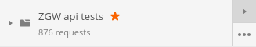

ZGW API Test scenario's
=======================

[Postman] collectie van test scenario's voor verschillende [Zaakgericht werken 
(ZGW) API's].

Inleiding
---------

De ZGW API standaard bestaat uit een OAS en documentatie met voornamelijk 
gedragsregels van de provider implementatie. De provider implementatie van deze
gedragsregels worden getest middels test scenario's, geschreven in [Postman].

Deze test scenario's worden onderhouden door de [API-teams] van de 
respectievelijke API's en o.a. gebruikt voor het [API testplatform] en 
continuous integration (CI) platformen van [API beheer].

Zelf aan de slag
----------------

Zorg dat de componenten de test data hebben ingeladen. Indien gebruik wordt
gemaakt van de Docker componenten, dan kan de test data ingeladen worden die
zich bevind in deze [Test scenario's] repository.

1. Download, installeer en start [Postman].

2. Navigeer naar **File** \> **Import...** en klik op de tab 
   **Import From Link**:

   
   
3. Voer onderstaande URL in en klik op **Import**: 
   `https://raw.githubusercontent.com/VNG-Realisatie/gemma-postman-tests/master/ZGW_api_postman_tests.json`
   
4. Er verschijnt een nieuwe collectie: **ZGW api tests**.

5. Navigeer naar **Manage Environments** (rechts bovenin) \> **Import** \> 
   **Choose file**

   
   
6. Voer onderstaande URL in en klik op **Open**:
   `https://raw.githubusercontent.com/VNG-Realisatie/gemma-postman-tests/master/local.postman_environment.json`
   
7. Er verschijnt een nieuwe omgeving: **ZGW api tests local**.

   Deze omgeving is afgestemd op lokaal draaiende Docker componenten. Open de 
   omgevingsinstellingen door te klikken op de naam **ZGW api tests local** en 
   pas aan waar nodig. Klik **Update** om de wijzigingen op te slaan.
   
8. Sluit het venster.

9. Hover over de collectie **ZGW api tests** en klik op de **Play** knop.

   
   
Licentie
--------

Copyright © VNG Realisatie 2019

[Licensed under the EUPL](LICENCE.md)

[Test scenario's]: https://github.com/VNG-Realisatie/gemma-postman-tests
[Zaakgericht werken (ZGW) API's]: https://github.com/VNG-Realisatie/gemma-zaken
[API-teams]: https://github.com/VNG-Realisatie
[Postman]: https://www.getpostman.com/downloads/
[API testplatform]: https://github.com/VNG-Realisatie/api-testvoorziening
[API beheer]: https://github.com/VNG-Realisatie/api-beheer
